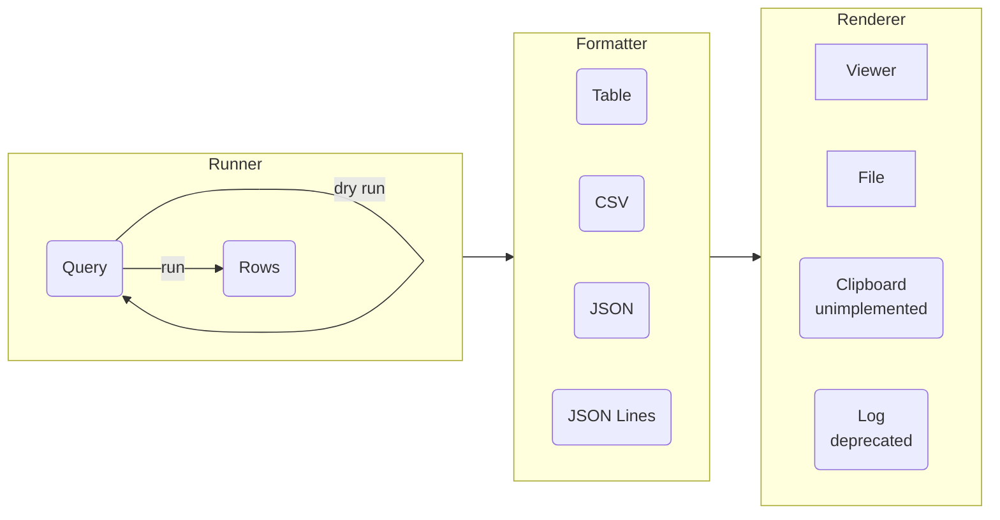

```mermaid
flowchart LR

    subgraph Runner
    direction LR
        Query(Query) -- dry run --> Query -- run --> data(Rows)
    end

    subgraph Formatter
    direction LR
        Table(Table)
        CSV(CSV)
        JSON(JSON)
        JSONL(JSON Lines)
    end

    subgraph Renderer
    direction LR
        Viewer
        File
        Clipboard(Clipboard\nunimplemented)
        Log(Log\ndeprecated)
    end

    Runner --> Formatter --> Renderer
```
