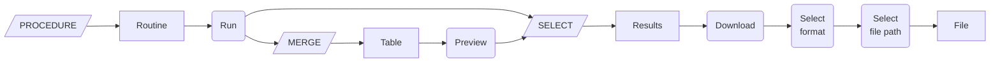
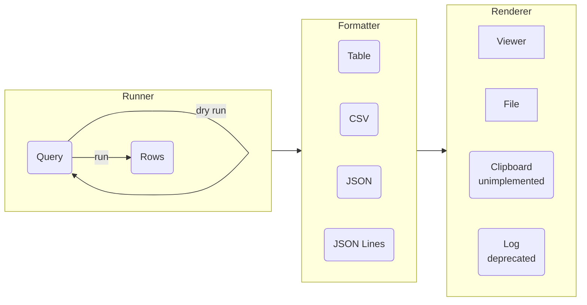

## Resource Lifecycle




## Processing



DEPRECATED

```json
        "bigqueryRunner.format.type": {
          "type": "string",
          "default": "table",
          "enum": [
            "table",
            "markdown",
            "json",
            "json-lines",
            "csv"
          ],
          "description": "Formatting method."
        },
        "bigqueryRunner.output.type": {
          "type": "string",
          "default": "viewer",
          "enum": [
            "viewer",
            "log",
            "file"
          ],
          "description": "The output destination for the query results.  When set to `viewer`, this extension opens the webview pane and renders the results with <table> tags. When set to `log`, this extension opens the output panel and outputs the results in the format set in `bigqueryRunner.format.type`. When set to `file`, this extension outputs the results as a file in the directory set in `bigqueryRunner.output.file.path`, in the format set in  `bigqueryRunner.format.type`."
        },
        "bigqueryRunner.output.file.path": {
          "type": "string",
          "default": ".",
          "description": "The output directory of the file when `bigqueryRunner.output.type` is specified as `file`."
        },
```

```typescript
switch (config.output.type) {
  case "log":
    return createLogOutput({
      formatter: createFormatter({ config }),
      outputChannel,
    });
  case "file": {
    if (!workspace.workspaceFolders || !workspace.workspaceFolders[0]) {
      throw new Error(`no workspace folders`);
    }

    const formatter = createFormatter({ config });
    const dirname = join(
      workspace.workspaceFolders[0].uri.path ||
        workspace.workspaceFolders[0].uri.fsPath,
      config.output.file.path
    );
    const path = join(
      dirname,
      `${basename(fileName, extname(fileName))}${formatToExtension(
        formatter.type
      )}`
    );
    await mkdirp(dirname);
    const stream = createWriteStream(path, "utf-8");

    return createFileOutput({
      formatter,
      stream,
    });
  }
}
```
